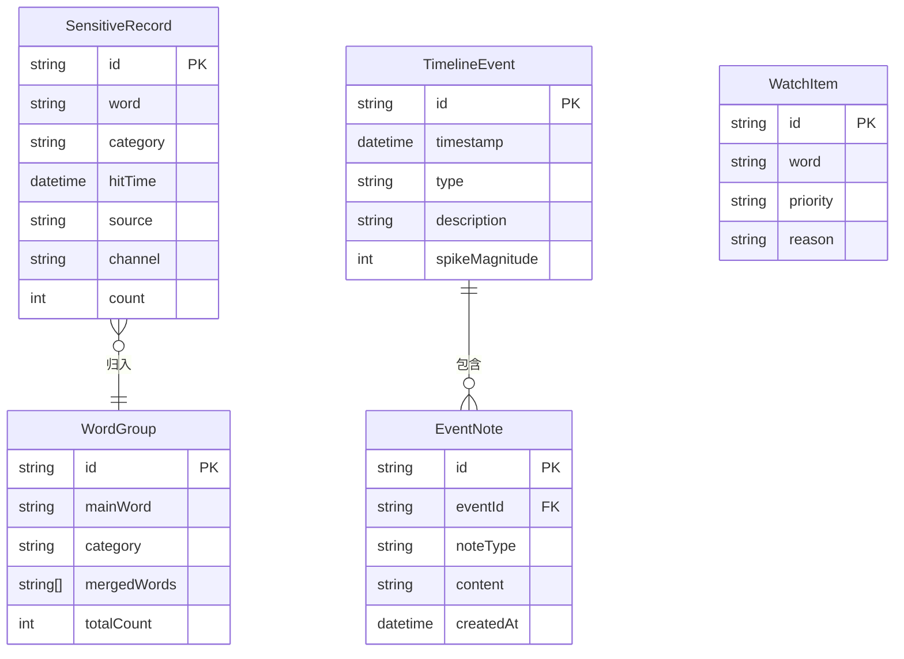

## 1. 架构设计

```mermaid
flowchart TB
    subgraph "前端层"
        "React App" --> "路由层 (React Router)"
        "路由层" --> "数据导入页"
        "路由层" --> "词组归因页"
        "路由层" --> "事件时间线页"
        "路由层" --> "复盘报告页"
    end
    subgraph "状态管理层"
        "Zustand Store" --> "数据状态 (导入记录)"
        "Zustand Store" --> "归因状态 (标签/合并)"
        "Zustand Store" --> "时间线状态 (事件/备注)"
        "Zustand Store" --> "报告状态 (统计/清单)"
    end
    subgraph "数据层"
        "Mock Data" --> "敏感词命中记录"
        "Mock Data" --> "标签定义"
        "Mock Data" --> "事件备注"
    end
    "前端层" --> "状态管理层"
    "状态管理层" --> "数据层"
```

## 2. 技术说明

- 前端：React@18 + TypeScript + Tailwind CSS@3 + Vite
- 初始化工具：vite-init（react-ts 模板）
- 后端：无（纯前端，使用 Mock 数据和本地状态）
- 数据库：无（使用 Zustand 进行状态管理，数据存储在内存和 localStorage）
- 图表库：Recharts（轻量级 React 图表库）
- 拖拽库：@dnd-kit/core + @dnd-kit/sortable（React 拖拽库）

## 3. 路由定义

| 路由 | 用途 |
|------|------|
| / | 重定向到 /import |
| /import | 数据导入页：上传文件、字段映射、数据预览 |
| /attribution | 词组归因页：标签分类、拖拽合并、词频统计 |
| /timeline | 事件时间线页：激增节点时间轴、节点备注 |
| /report | 复盘报告页：高频词、渠道、耗时、关注清单 |

## 4. API 定义

无后端 API，全部使用前端 Mock 数据。

## 5. 服务器架构图

不适用（纯前端项目）

## 6. 数据模型

### 6.1 数据模型定义



### 6.2 数据定义语言

```typescript
interface SensitiveRecord {
  id: string
  word: string
  category: 'abuse' | 'boycott' | 'quality' | 'fake_ad' | 'price'
  hitTime: string
  source: string
  channel: 'weibo' | 'douyin' | 'xiaohongshu' | 'wechat' | 'other'
  count: number
}

interface WordGroup {
  id: string
  mainWord: string
  category: SensitiveRecord['category']
  mergedWords: string[]
  totalCount: number
}

interface TimelineEvent {
  id: string
  timestamp: string
  type: 'spike' | 'official_response' | 'media_report' | 'influencer_repost'
  description: string
  spikeMagnitude: number
  notes: EventNote[]
}

interface EventNote {
  id: string
  eventId: string
  noteType: 'official_response' | 'media_report' | 'influencer_repost' | 'other'
  content: string
  createdAt: string
}

interface WatchItem {
  id: string
  word: string
  priority: 'high' | 'medium' | 'low'
  reason: string
}
```
